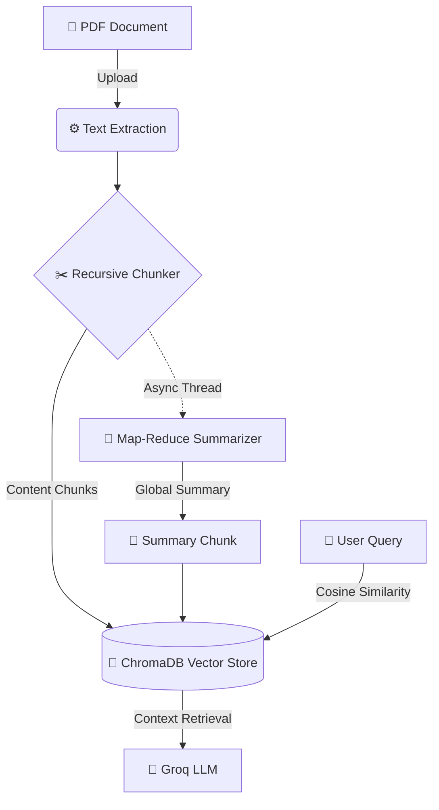

# 📄 PDF-Pal

[](https://pdf-pal-v1.streamlit.app/)
[](https://github.com/astral-sh/uv)
[](https://www.python.org/downloads/)

A conversational RAG (Retrieval-Augmented Generation) application built beautifully on Streamlit.
Upload your PDF files and chat directly with their content!

<!-- 📸 PRO TIP: Uncomment the line below and add a GIF/Screenshot of your UI to make this README a 10/10! -->
<!-- <p align="center"></p> -->

> **🌐 Live Demo:** You can access the deployed application here: [https://pdf-pal-v1.streamlit.app/](https://pdf-pal-v1.streamlit.app/)

## ✨ Features

- **Blazing Fast Text Extraction:** Process PDFs seamlessly right in your browser.
- **Powered by Groq:** Uses the lightning-fast `llama-3.1-8b-instant` model via the Groq API.
- **Local Smart Embeddings:** Advanced offline semantic search natively powered by ChromaDB.
- **Intelligent Summarization:** Uses a background Map-Reduce pipeline to summarize large documents without hitting context limits or hanging the UI.
- **Beautiful User Interface:** A modern, clean Streamlit chat UI with session history.

## 🧠 System Architecture



## 🔒 Privacy & Data Security

- **Zero Data Retention:** This application operates entirely in volatile RAM. No chat histories or document embeddings are stored or saved to any database.
- **Secure File Processing:** When using the hosted Streamlit Community Cloud app, your PDFs are processed exclusively in temporary memory. The server does **not** store your uploaded files.
- **Ephemeral Sessions:** The moment you close or refresh the browser tab, or the server goes to sleep, all uploaded data is instantly and permanently erased.

## 🚀 Setup & Installation

### Prerequisites
You must have [uv](https://github.com/astral-sh/uv) installed to manage dependencies and boot the application.

**Install `uv` (macOS / Linux):**
```bash
curl -LsSf https://astral.sh/uv/install.sh | sh
```

**Install `uv` (Windows):**
```powershell
powershell -ExecutionPolicy ByPass -c "irm https://astral.sh/uv/install.ps1 | iex"
```

1. **Clone the repository:**
   ```bash
   git clone https://github.com/Naveen-PJ/PDF-Pal.git
   cd PDF-Pal
   ```

2. **Sync the Environment:**

   **Option A: The Fast Way (Using `uv`)**
   ```bash
   uv sync
   ```

   **Option B: The Traditional Way (Using `pip`)**
   ```bash
   python -m venv venv
   source venv/bin/activate  # On Windows use: venv\Scripts\activate
   pip install -r requirements.txt
   ```

3. **Configure API Keys:**
   Create a `.streamlit/secrets.toml` file and add your Groq API key:
   ```toml
   [groq]
   API_KEY = "your-api-key-here"
   ```

## 💻 Running Locally

To fire up the application locally, run:

**Using `uv`:**
```bash
uv run streamlit run main.py
```

**Using Traditional `pip`:**
```bash
# Make sure your virtual environment is activated first!
streamlit run main.py
```

## 📜 License

This project is licensed under the GNU General Public License v3.0. See the [LICENSE](LICENSE) file for details.